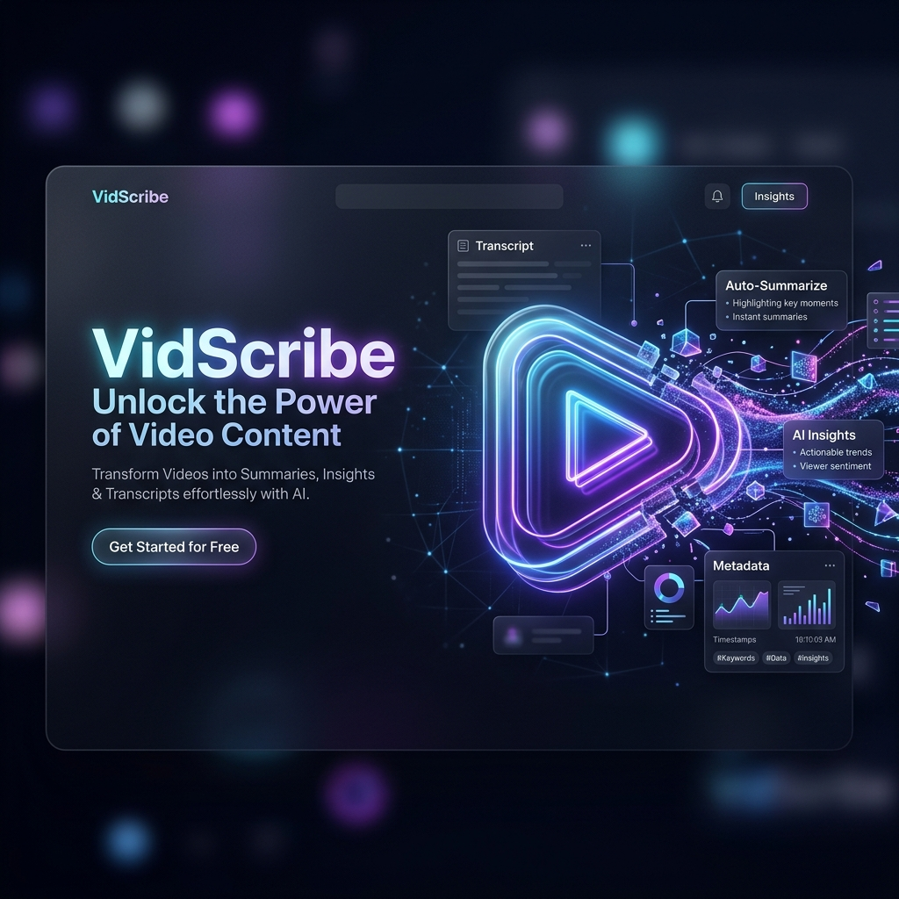

<div align="center">
  
  
  # VidScribe 🎥✨
  **The ultimate AI-powered YouTube Intelligence Platform.**

  [](https://opensource.org/licenses/MIT)
  [](https://nextjs.org/)
  [](https://fastapi.tiangolo.com/)
  [](https://ai.google.dev/)
  [](https://www.mongodb.com/)
</div>

---

VidScribe is a state-of-the-art web application that transforms any YouTube video into structured, actionable knowledge. Powered by Google's **Gemini 2.5 Flash AI**, it provides instant summaries, key insights, and searchable interactive transcripts for videos in **any language**—all wrapped in a premium, glassmorphic dark-mode user interface.

Whether you're a student summarizing two-hour lectures, a developer parsing long tutorials, or a professional extracting insights from podcasts, VidScribe saves you hundreds of hours.

---

## 🚀 Key Features

- 🔐 **Secure Authentication**: Seamless Google OAuth integration via NextAuth. Your history and data are safely tied to your personal account.
- 🌍 **Multi-Language Generation**: Select your preferred output language. The AI natively translates its understanding and generates summaries and insights in Spanish, Hindi, French, Japanese, and more.
- 🔊 **Smart Audio Fallback**: No captions? No problem. If a video lacks a text transcript (or if YouTube blocks the request), VidScribe automatically downloads the audio track via `yt-dlp` and parses it directly through Gemini's native audio understanding.
- 🔗 **Shareable Links**: Every summarized video generates a dedicated URL (`/v/[id]`). Copy and share the link with anyone to give them instant access.
- 📜 **Interactive & Searchable Transcript**: A beautifully formatted transcript with clickable timestamps that automatically seek the embedded YouTube player. Includes a sticky floating search bar for instant keyword filtering.
- 💬 **Ask the Video**: A dedicated chat interface allowing you to ask specific, contextual questions about the video content in real-time.
- 🗄️ **Smart History & Caching**:
  - **MongoDB History**: Automatically tracks your previously summarized videos in the cloud, complete with dynamic language badges.
  - **Redis Caching**: Video metadata and AI summaries are cached via Redis for lightning-fast retrieval on subsequent visits, preventing redundant API calls.

---

## 🛠️ System Architecture

1. **Frontend (Next.js 16)**: A highly responsive, React 19 interface styled with Tailwind CSS v4. Features custom scrollbars, premium glassmorphic cards, NextAuth for Google logins, and real-time SSE streaming for the chat interface.
2. **Backend API (FastAPI)**: A high-performance, asynchronous Python backend that orchestrates the data pipeline and handles JWT verification.
3. **Extraction Layer**: Uses `youtube-transcript-api` for fast captions, `yt-dlp` for heavy audio fallback, and the YouTube Data API v3 for high-res thumbnails and metadata.
4. **AI Engine**: Communicates asynchronously with the `google-generativeai` SDK, securely passing massive transcripts or raw audio files.
5. **Data Layer**: Dual-database approach using **Redis** for ephemeral high-speed caching and **MongoDB (Motor)** for persistent user history tracking.

---

## 🚦 Local Setup

### 1. Prerequisites
- **Python 3.9+** & **Node.js 18+**
- **FFmpeg**: Required for the `yt-dlp` audio fallback system. Must be installed and accessible in your system's PATH.
- **MongoDB Database** (MongoDB Atlas recommended)
- **Redis Server** (Local or Cloud like Upstash)
- **API Keys**:
  - `GEMINI_API_KEY` (Google AI Studio)
  - `YOUTUBE_API_KEY` (Google Cloud Console)
  - Google OAuth Credentials (`GOOGLE_CLIENT_ID`, `GOOGLE_CLIENT_SECRET`)

### 2. Backend Setup
```bash
cd backend
python -m venv .venv
# Windows: .venv\Scripts\activate | Mac/Linux: source .venv/bin/activate
pip install -r requirements.txt

# Configure your environment variables
cp .env.example .env
# Edit .env and add your API keys, MongoDB URI, and Redis URL

# Run the server
uvicorn app.main:app --reload
```

> **Note on Bot Protection:** To prevent YouTube from blocking transcript requests, export your YouTube cookies (using an extension like "Get cookies.txt LOCALLY") and save the file as `backend/youtube_cookies.txt`.

### 3. Frontend Setup
```bash
cd frontend
npm install

# Configure your environment variables
cp .env.example .env
# Edit .env and add your NEXTAUTH_SECRET and Google Auth credentials

# Run the dev server
npm run dev
```

Visit `http://localhost:3000` to start analyzing!

---

## 🤝 Contributing

Contributions are what make the open source community such an amazing place to learn, inspire, and create. Any contributions you make are **greatly appreciated**.

1. Fork the Project
2. Create your Feature Branch (`git checkout -b feature/AmazingFeature`)
3. Commit your Changes (`git commit -m 'Add some AmazingFeature'`)
4. Push to the Branch (`git push origin feature/AmazingFeature`)
5. Open a Pull Request

---

## 📝 License

Distributed under the MIT License. See `LICENSE` for more information.

---
<div align="center">
  <i>Built with ❤️ by Arnab</i>
</div>
